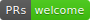

# Pre-interview screen: Front-end Developer

  

Hello, potential BNZ Front-end Developer!

The purpose of this screen is to determine whether a job applicant has the potential to succeed as a front-end developer at BNZ Digital.

A review of your **pull request** will be used to decide whether to invite you to an initial interview. This is only the first step in the hiring process, but it's an important one. It benefits neither you nor BNZ to hire a you into a position for which you are unsuited. This screen helps us to prevent wasted time by either party, so you, the applicant, can focus on those jobs for which you're best qualified, and we, the bank, can focus our efforts where they will be most fruitful.

## Instructions

_Please read these instructions carefully!_

Reread them before you begin, if necessary, and check them whenever you need to.

1. **You are welcome to use any resources you have available.** You'll have them available on the job, so why not here? This isn't a test of your ability to memorize! Using resources well is a good thing, so please add a comment in your code listing any resources you used.
1. We want to see how you **work through the feature request we provide below**. You don't need to be an expert at the types of code you'll find here: just show us how you'd go about solving it. If you _are_ an expert, then do your best to impress us. If not, then show us how you would bring yourself up to speed.
1. Choose a time when **you can work for two hours uninterrupted and without distractions**. We'll check the timestamps on your commits to get a feel for how long things took. If you get interrupted, that will throw your times way off. So please try to work steadily for two hours.
1. You can put in more time if you want to, but **two hours ought to be enough**. That said, you don't have to finish the feature. Is anything ever really finished? Get as far as you can in the time you have available.
1. Do the best work you can. **It's not just about the code.** Show us all your chops! We'll be looking at the big picture: How well do you think? How is your attention to detail? Can you work well with others? And more.
1. **Document! Document! Document!** Use comments in the code to explain your thinking: What made you choose this way? What kinds of things are you looking out for? Did you consider any other ways? If so, what made you reject them? Help us to get to know the real you. If we invite you to come in for an interview, these are the sorts of issues about which we will follow up.

**Note:** Using resources is wise; copying and pasting large amounts of code or having someone else do the work for you will only waste your time and ours: it will become quickly evident what happened when you get to the first interview. In other words, don't try to game the system; just do your best work. This isn't a test; it's a matchmaker. **We're looking for a good match.**

## The challenge

**Add a feature to the CountryCodeTable.** You could make the columns sortable in one or both directions. You could add a search feature, or a filter that filters by rows. What about pagination? It's up to you, but try to choose something that you can make reasonable progress on in two hours' time. Or, if you're already an expert in this code, the sky's the limit. Blow us away.

## Requirements

You'll need a recent version of **[node.js](https://nodejs.org/en/download/)**, a good text editor (**[Atom](https://atom.io/)**, **[Visual Studio Code](https://code.visualstudio.com/)**, etc.), and a recent browser (**[Chrome](https://www.google.com/chrome/browser/desktop/index.html)**, **[Firefox](https://www.mozilla.org/en-US/firefox/new/)**, etc.). Optionally, you can install **[yarn](https://yarnpkg.com/en/)**, but **[npm](https://www.npmjs.com/)** will work as well. If you're working in Chrome, consider installing the [Redux DevTools](http://extension.remotedev.io/) extension. It will really help. [React DevTools](https://github.com/facebook/react-devtools) can also be useful.

## Procedure

1. Fork this repository.
2. `cd` into the project directory and install the dependencies with `yarn` or `npm install`.
3. Run the tests with `yarn coverage` or `npm run coverage`. You should see all green and 100% coverage. If not, let us know.
4. Run the app. **Important:** You'll need to run both the **app** and the **API server**.
    * In one terminal window/tab, use `yarn server` or `npm run server` to start the server.
    * In another terminal window/tab, use `yarn start` or `npm start` to start the app.
    * A browser should open pointing to [http://localhost:4000/](http://localhost:4000/). If not, open one yourself. You should see a table listing calling codes by country.
    * You can make sure the server is running by opening [http://localhost:4001/externalData](http://localhost:4001/externalData) in a browser. You should see a JSON array of country calling code objects.
5. Commence work on the problem, paying attention to the instructions above.
6. **Make frequent commits! Make frequent commits! Make frequent commits!** We want to see how your code develops and how much time you spent on each part.
7. **Document your thinking!** (Use comments in the code, preferably). Help us to understand why you went the route you did.
8. After a couple of hours work, give or take, find a point where you can stop&mdash;don't worry if you haven't finished the feature&mdash;and do a final commit.
9. _Did we mention documenting your reasoning for your decisions?_ Make sure you've documented it well.
10. When you're sure you're ready, **do a pull request to us**. In the PR description, tell us what you did and why. Include anything you want us to consider when reviewing your code.

## Resources

This application was created initially with [create-react-app](https://github.com/facebookincubator/create-react-app): create React apps with no build configuration. It has been [ejected](https://github.com/facebookincubator/create-react-app#converting-to-a-custom-setup).

Here are some links to documentation for the languages, libraries, and frameworks used in this code sample. **Most of this you won't need, but it's here just in case.**

* [babel](https://babeljs.io/): The compiler for next generation JavaScript
* [bootstrap](http://getbootstrap.com/): The world's most popular front-end component library
* [bootswatch](https://bootswatch.com/cerulean/): Free themes for Bootstrap (Cerulean theme used)
* [deepfreeze](https://github.com/serapath/deepfreeze): Recursively Object.freeze() on objects and functions with properties
* [dotenv](https://github.com/motdotla/dotenv): Load environment variables from .env for Node.js projects
* [enzyme](http://airbnb.io/enzyme/): JavaScript Testing utilities for React
* [eslint](https://eslint.org/): The pluggable linting utility for JavaScript and JSX
* [jest](https://facebook.github.io/jest/): Delightful JavaScript testing
* [koa](http://koajs.com/): A next generation web framework for Node.js
* [koa-better-router](https://github.com/tunnckoCore/koa-better-router): Stable and lovely router for koa, using path-match
* [koa-json](https://github.com/koajs/json): Pretty-printed JSON response middleware
* [koa2-cors](https://github.com/zadzbw/koa2-cors): CORS middleware for Koa v2
* [prop-types](https://github.com/facebook/prop-types): Runtime type checking for React props and similar objects
* [ramda](http://ramdajs.com/) A practical functional library for JavaScript programmers (check out the [REPL](http://ramdajs.com/repl/))
* [react-bootstrap](https://react-bootstrap.github.io/): The most popular front-end framework, rebuilt for React
* [react](https://reactjs.org/): A JavaScript library for building user interfaces
* [redux-mock-store](http://arnaudbenard.com/redux-mock-store/): A mock store for your testing your redux async action creators and middleware
* [redux-observable](https://redux-observable.js.org/): RxJS5-based middleware for Redux
* [redux](https://redux.js.org): A predictable state container for JavaScript apps
* [rxjs](http://reactivex.io/rxjs/): A library for reactive programming using Observables, to make it easier to compose asynchronous or callback-based code
* [webpack-dev-server](https://webpack.js.org/configuration/dev-server/): A little Node.js Express server, which uses the webpack-dev-middleware to serve a Webpack bundle
* [webpack](https://webpack.js.org/): An open-source JavaScript module bundler

These are also available should you want them:

* [date-fns](https://date-fns.org/v2.0.0-alpha.7/docs/Getting-Started): Modern JavaScript date utility library
* [ramda-adjunct](https://char0n.github.io/ramda-adjunct/): A community maintained extension of Ramda
* [recompose](https://github.com/acdlite/recompose): A React utility belt for function components and higher-order components
* [reselect](https://github.com/reactjs/reselect): Selector library for Redux
* [shortid](https://github.com/dylang/shortid): Short id generator

Feel free to add any other libraries you might need, but be sure to tell us what you added and why.

## What's next?

When we see your pull request we'll acknowledge it. Then we'll review it. If we determine that you might be a good fit for the job, then we'll contact you to set up a first interview. If we think the job is not for you, we'll still consider you for any other positions you might fit. Any way you cut it, we won't leave you hanging. We'll tell you the outcome either way.

Have fun! We look forward to seeing your work.
